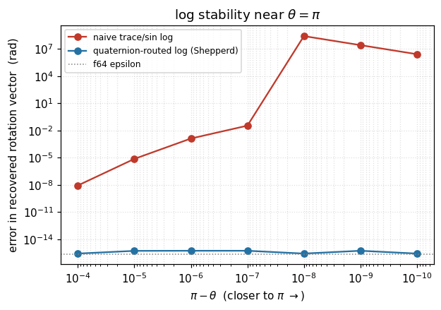
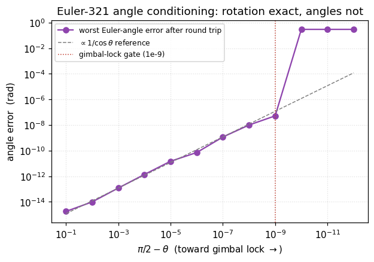
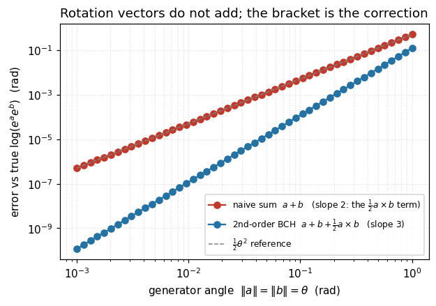

# nav-rs

A Rust workspace for navigation and estimation math. The **`nav-attitude`**
crate provides rigid-body attitude representations — quaternions, direction
cosine matrices, Euler angles, and rotation vectors — as four interchangeable
charts on SO(3), with explicit, tested conventions and conversions between
all of them.

## Conventions

One contract holds across every representation: **Hamilton** quaternions,
stored **scalar-first** `[w, x, y, z]`, used as **active** operators, in
**radians**, with Euler angles as a **321 intrinsic** (yaw–pitch–roll)
sequence and rotation-vector `log` on the **principal branch** `‖φ‖ ≤ π`.
The full table — with the composition order, the double-cover identification,
and the small-angle seam — lives in the crate-root rustdoc; run
`cargo doc --open -p nav-attitude` to read it.

## Three things the design gets right

Each figure is generated by [`docs/make_plots.py`](docs/make_plots.py).
Two are plotted straight from numbers the crate's own tests print under
`-- --nocapture`; the third is computed with scipy.

### `log` is stable at θ = π

The naive trace/sine inverse loses all its digits as θ → π (the rotation
angle where `sin θ → 0`); routing `log` through the quaternion (a Shepperd-
style extraction) holds at machine epsilon throughout. Data from
`naive_log_degrades_near_pi_quat_path_does_not`.



### Euler angles are ill-conditioned at gimbal lock

Approaching pitch = π/2, the *rotation* round-trips exactly, but recovering
the three *angles* amplifies error like `1/cos θ` — which is exactly why the
crate integrates quaternions and treats Euler angles as display-only. Past
the gimbal-lock gate the extraction collapses to its roll = 0 gauge. Data
from `conditioning_sweep`.



### Rotation vectors do not add

`log(eᵃ·eᵇ) ≠ a + b`: naive summation drops the Lie-bracket term ½·a×b and
errs at second order in the angle, while second-order BCH errs at third
order. Compose through `exp`, never by summing rotation vectors. Companion to
the `bch_second_order` and `rotation_vectors_do_not_add` tests.



## Build

```sh
cargo test --workspace      # unit, property, and nalgebra-oracle tests
cargo doc --open -p nav-attitude
python3 docs/make_plots.py  # regenerate the figures above
```
