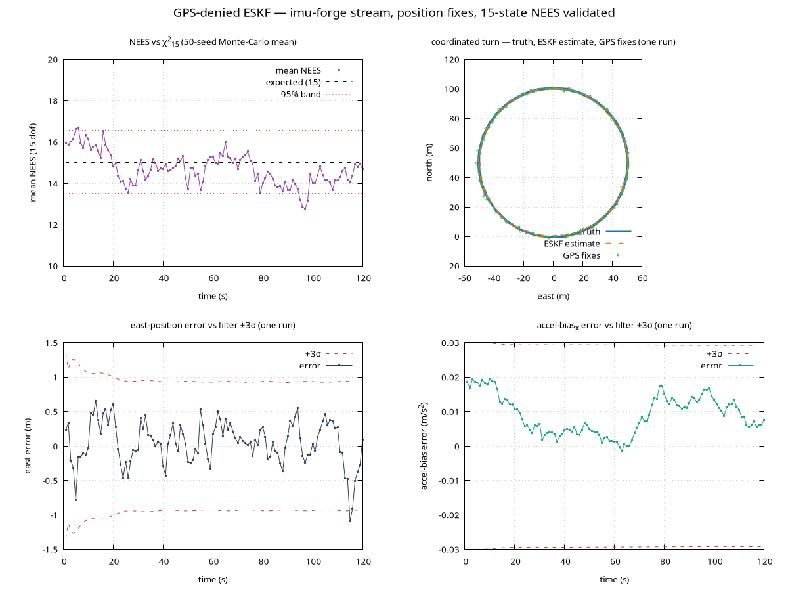
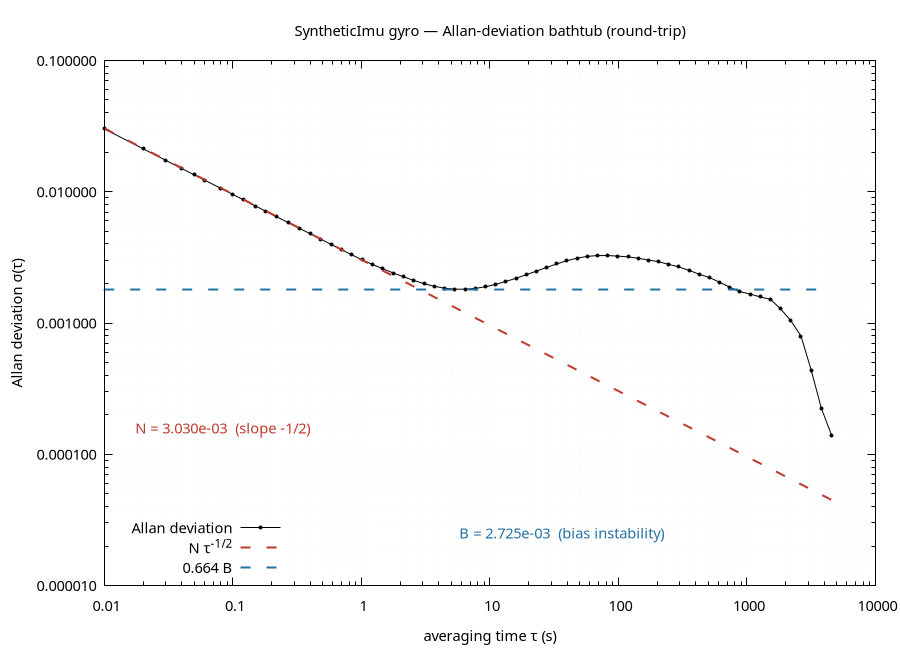

# nav-rs

**A GPS-denied inertial navigation filter, built from scratch in Rust — and statistically validated.**

`nav-rs` builds a navigation stack from the ground up: from the SO(3) rotation
math, through a synthetic IMU characterized by its Allan variance, to a 15-state
error-state Kalman filter that fuses the inertial stream with sparse position
fixes. The filter's correctness isn't asserted — it's *proven*: across a
Monte-Carlo ensemble, its estimation error rides the χ²₁₅ consistency band.



The capstone: a 15-state ESKF dead-reckons an Allan-characterized IMU through a
coordinated turn, folding in a position fix every second. Over 50 seeds the
15-DOF NEES sits on its expected value of 15, inside the 95% χ² band (top-left)
— the filter is **consistent**, its covariance an honest account of its own
error. The error stays within the filter's ±3σ envelope (bottom), and the
estimate tracks truth through the noisy GPS fixes (top-right).

## The pipeline

Each crate builds on the one before it:

| Crate | Role |
| --- | --- |
| [`nav-attitude`](crates/nav-attitude) | SO(3) attitude math — quaternion, DCM, Euler, and rotation-vector charts under one explicit convention, with numerically robust conversions between all four. |
| [`nav-kf`](crates/nav-kf) | A textbook linear Kalman filter, and the consistency methodology used throughout: seed-averaged NEES/NIS scored against χ² acceptance bands. |
| [`nav-imu`](crates/nav-imu) | A synthetic IMU with an Allan-characterized error model (white noise + Gauss–Markov bias), Allan-deviation analysis, and a strapdown INS mechanization. |
| [`nav-eskf`](crates/nav-eskf) | The capstone: a 15-state error-state KF `[δp, δv, δθ, δbₐ, δb_g]` fusing IMU and position fixes — validated above. |

## What this demonstrates

- **Correctness is measured, not claimed.** Every layer is checked against an
  independent oracle (nalgebra, SciPy, closed form), and the filter is held to
  the same NEES/χ² consistency test real estimators are — the single most common
  way a filter that *looks* like it works is silently wrong.

- **Sensor noise is characterized, not guessed.** The IMU's white-noise density
  and bias instability are read straight off its Allan bathtub, and the *same* σ
  feeds the filter's process model — sensor model and estimator agree by
  construction.

  

- **The hard parts of rotations are handled.** `log` holds at machine precision
  through θ = π, Euler extraction is gated at gimbal lock, and rotations compose
  through `exp` (never by adding rotation vectors):
  [log near π](docs/log_near_pi.png) ·
  [gimbal-lock conditioning](docs/euler_conditioning.png) ·
  [BCH residual](docs/bch_residual.png).

## Build & reproduce

```sh
cargo test --workspace                        # unit, property, oracle, and NEES consistency tests
cargo run --release --example eskf_nees       # the validation plot above (then `gnuplot eskf_nees.gp`)
cargo run --release --example allan_bathtub   # the IMU Allan characterization
cargo run --release --example ins_deadreckon  # pure inertial dead-reckoning — watch it diverge
cargo doc --open -p nav-attitude              # the full attitude-conventions table
python3 docs/make_plots.py                    # regenerate the nav-attitude figures
```
